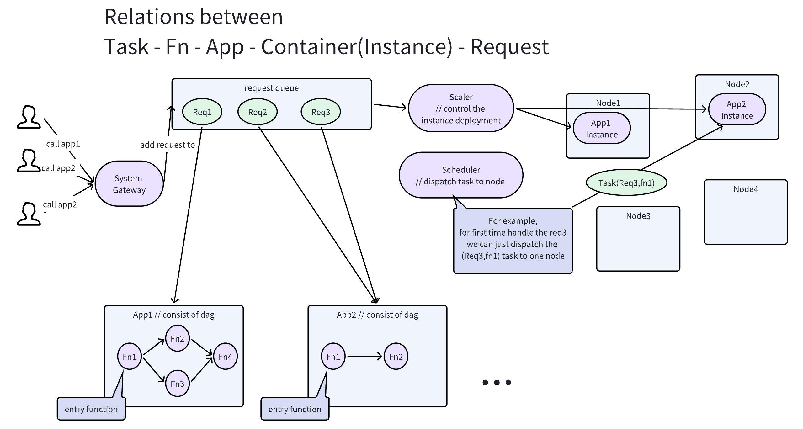
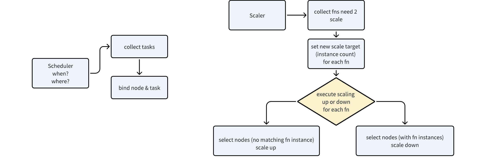

# serverless_sim

## 1. Feishu doc

https://fvd360f8oos.feishu.cn/docx/Q3c6dJG5Go3ov6xXofZcGp43nfb

## 2. Develop standard

[项目迭代规范](https://fvd360f8oos.feishu.cn/wiki/PwQQwjt3liLWcXkoO1McqQrEnHb)

## 3. Environment

### Rust

``` Plaintext
// Switch to tested default version
rustup default 1.74
 ```

### Pylibs (Basical)

follow the requirements_basic.txt

### Pylibs (Just for RL Scaler)

pip install -r requirements.txt

### CUDA (Just for RL Scaler)

[https://developer.nvidia.com/cuda-downloads?target_os=Windows&target_arch=x86_64&target_version=11&target_type=exe_local](https://developer.nvidia.com/cuda-downloads?target_os=Windows&target_arch=x86_64&target_version=11&target_type=exe_local)

## 4. Get started

- Open project in serverless_sim directory, run following command and make sure the server's running

    ``` Plaintext
    cargo run
     ```

- [Run the test script in root dir (run_different_req_freq.py). Records will be generated in serverless_sim/records](https://github.com/340Lab/serverless_sim/blob/main/run_different_req_freq.py)

- Run collect_seed_metrics.py, check result in serverless_sim/records/seed_xxx.json.

- Start frontend ui

    - Open the ui project in serverless_sim_ui

    - Use pnpm or yarn to start the frontend.

        ``` YAML
        // if didn't install
        yarn install
        
        // run
        yarn run dev
         ```

## 5. Arch & Flow

The process flow will help you build up a general view about this simulation framework.

``` 
 ```

Relations between Task - Fn - App（DAG） - Container - Request



Scaler & Scheduler General Pattern



## 6. Roadmap

Refactor

- refactor: use new mechanism

- [refactor: new config for mechanisms. pr/33](https://github.com/340Lab/serverless_sim/pull/33)

- [refactor: divide sim env into sub mods. pr/32](https://github.com/340Lab/serverless_sim/pull/32)

Experimental

[sim支持python脚本vscode右键运行 pr/17 feat:New python script file can directly “run code” by YouMeiYouMaoTai · Pull Request #17 · 340Lab/serverless_sim (github.com)](https://github.com/340Lab/serverless_sim/pull/17)

## 7. Algorithms

### FaasFlow

src: sche_faasflow.rs

paper: https://dl.acm.org/doi/abs/10.1145/3503222.3507717

``` 

同步自文档: https://fvd360f8oos.feishu.cn/docx/Za01dnGHJoYJ0Hxu0vBcM4uon3f#HSO9dZrVlszPyPbPSwvc4sLwnkb
 ```

### FnSched

src: sche_fnsche

paper: https://dl.acm.org/doi/abs/10.1145/3366623.3368136

``` 

同步自文档: https://fvd360f8oos.feishu.cn/docx/Za01dnGHJoYJ0Hxu0vBcM4uon3f#XVqyddSNSsKDVPbhsZJc5tdpnrb
 ```

### PASS

src: sche_pass

Papar: https://ieeexplore.ieee.org/abstract/document/9812887 

``` 

同步自文档: https://fvd360f8oos.feishu.cn/docx/Za01dnGHJoYJ0Hxu0vBcM4uon3f#A6jwdzRCSs4xj4b5lzscENNXnLb
 ```

### POS

src: sche_pos


### HPA

src: scaler_hpa

paper: https://arxiv.org/abs/2403.07909


